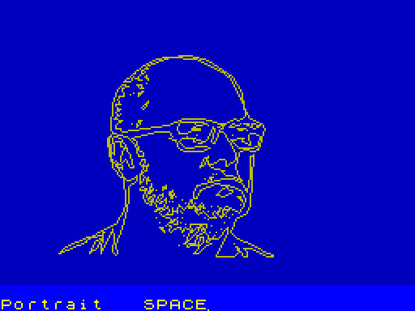

[](http://www.apache.org/licenses/LICENSE-2.0)
[](https://bell-sw.com/pages/downloads/#jdk-25-lts)   
[](https://www.arthursacresanimalsanctuary.org/donate)

# j2z80

j2z80 is a Maven plugin that translates compiled JVM bytecode into Z80 machine code. It is a pattern compiler: each
bytecode becomes a short native sequence, with only light cleanup of redundant stack pairs. The result is one binary
image for a 64 KB address space. It can be started on a real Z80 machine or under an emulator.

It is a translator, so the running program is native Z80. There is no bytecode interpreter and no tracing garbage
collector.

The program entry point is `public static void mainz()`. The plugin reads a JAR (the project JAR by default), translates
its classes, and writes assembler (`.a80`), a raw binary (`.bin`), or a ZX Spectrum 48K snapshot (`.sna`). Output
formats, the start address, and the stack top are described in [docs/configuration.txt](docs/configuration.txt).

The ZX Spectrum example draws a line-art portrait, an attribute Mandelbrot, a star field that `Heap.forget` releases,
and float/double curves. SPACE moves from one picture to the next. The portrait line shows the current `Heap.top()`
in hex (`press space (top #FAD0)`), so a later pass can be checked against the same address.



```java
public static void mainz() {
  while (true) {
    greet();
    waitForSpace();
    showOverview();
    waitForSpace();
    showStars();
    showCurves();
    waitForSpace();
  }
}
```

[Hello World example](j2z80-examples/zx-spectrum-hello-world/src/main/java/com/igormaznitsa/test/helloworld/main.java)

Classes, fields, constructors, virtual and interface calls, `instanceof`, and `checkcast` are translated. `checkcast` of
`null` succeeds. A method may use fewer than 64 local slots, because locals are addressed with a signed IX displacement.
A `long` or a `double` occupies two slots. Enum constants, fields, `ordinal()`, `values()`, and `switch` are translated;
`name()` and `valueOf` are rejected because there is no String. `synchronized` is ignored: the machine is
single-threaded, and `monitorenter` / `monitorexit` only drop the reference. The standard Java library is absent.
`java.lang.Object` provides `<init>` and `hashCode` (the object address). `j2z80.Heap` rewinds the bump heap; see
[Objects and the heap](#objects-and-the-heap). There is no `String` type with methods; a
string literal is a length byte followed by raw 8-bit characters, at most 255 of them, and every character must fit in 8
bits.

## Data types

Every value lives in 16-bit slots. Arithmetic that does not fit the slot wraps or is rejected when the class is
translated.

| Java type                 | Storage                                  | What the program actually gets                                                                                                               |
|---------------------------|------------------------------------------|----------------------------------------------------------------------------------------------------------------------------------------------|
| `boolean`, `byte`, `char` | one slot; array elements are 8-bit       | `char` and string characters must be in 0..255                                                                                               |
| `short`, `int`            | one signed 16-bit slot                   | constants must be in −32768..32767. Multiply, divide, and shifts stay in 16 bits, so `>>>` is a 16-bit shift                                 |
| `float`                   | one slot, IEEE binary16                  | half precision, with subnormals, infinities, and NaN. `f2i` clamps to a signed 16-bit int. Divide by zero yields infinity and does not throw |
| `long`                    | two slots, signed 32-bit, low word first | constants outside −2147483648..2147483647 are rejected. Divide by zero is a fault. A logical shift is a 32-bit unsigned shift                |
| `double`                  | two slots, IEEE binary32, low word first | the same width as a Java `float`. `drem` is a truncating remainder                                                                           |
| reference                 | one 16-bit address                       | `null` is address 0                                                                                                                          |

`long` and `double` return with the low word in BC and the high word in DE. An `int`, a `float`, or a reference returns
in BC.

Integer divide by zero does not become a catchable `ArithmeticException`. The generated code jumps through the athrow
address, which is 0 unless you change it, so the usual effect is a reset. Field and array access do not test for `null`
and do not test the index.

## Exceptions

Only checked exceptions are translated. `RuntimeException`, `Error`, and any subclass of either cannot be declared,
thrown, caught, or extended. The translator stops with an error if it sees one.

A method that declares `throws` writes a hidden pending-exception cell: 0 on a normal return, or the exception object on
`throw`. Each call of such a method tests that cell. A covering `catch` receives the object; otherwise the caller
returns and its caller sees the same cell. Handler choice is fixed when the method is translated, by an `instanceof`
test against the catch type, so a subclass is caught by a parent handler. There is no runtime unwind table. An exception
that leaves a method which does not declare `throws` jumps to address 0.

`finally` runs on the way out of `try`, including `return`, `break`, `continue`, and a throw. Exception objects have a
no-argument constructor only.

```java
public class Signal extends Exception {
}

public static int parse(final int code) throws Signal {
  if (code < 0) {
    throw new Signal();
  }
  return code;
}

public static int read(final int code) {
  try {
    return parse(code);
  } catch (Signal signal) {
    return 0;
  } finally {
    attempts = attempts + 1;
  }
}
```

## Arrays

`new` of a one-dimensional array is supported for every primitive type and for references. A new array is zeroed. The
reference points at the first element. In front of that element the heap stores a size byte (1, 2, or 4) and a length
word, and `array.length` reads that word.

```java
int[] row = new int[32];
row[index]=row[index]+1;

byte[][] grid = new byte[8][8];
long[] wide = new long[4];
```

`byte[]`, `boolean[]`, and `char[]` store one byte per element. `short[]`, `int[]`, `float[]`, and reference arrays
store one 16-bit word. `long[]` and `double[]` store four bytes per element. A multi-dimensional array is an array of
those word references. A dimension whose length is 0 is skipped. `new long[][]` and `new double[][]` are rejected,
because `multianewarray` of `long` or `double` is not implemented. One-dimensional `long[]` and `double[]` are fine.

Nothing checks the index or the reference. An index past the end writes whatever follows the array in memory.

## Objects and the heap

`new` allocates an instance on a bump heap. The heap grows upward from a fixed start, and the stack grows downward from
the stack top. The free memory is the gap between `Heap.top()` and the stack. When the heap meets the stack, further
allocation overwrites the stack. There is no check and no exception.

Each instance starts with a 4-byte header: a word that counts field cells (one cell is two bytes), then a word that
holds
the class id. The reference points at the first field, four bytes after that header, and `hashCode()` returns that
reference. The allocator zeroes the fields. Every address is a signed 16-bit value, so an address at or above 32768
reads as a negative `int`.

```java
public class Point {
  public int x;
  public int y;

  public Point(final int x, final int y) {
    this.x = x;
    this.y = y;
  }
}

Point point = new Point(10, 20);
```

Nothing collects garbage. Dropping the last reference does not release memory, and there is no finalizer. The release
is `j2z80.Heap.forget`, which rewinds the bump pointer. `java.lang.Object` has no `forget()`.

```java
import j2z80.Heap;

int mark = Heap.top();
StarField sky = new StarField();
Heap.forget(sky);
```

`Heap.forget(sky)` sets the bump pointer back to the address it had before `sky` was created. That address is the
instance reference minus 4, and it is the same value `mark` holds. That instance and every instance allocated after it
are released, and the next `new` reuses the space. Instances allocated earlier stay where they are.
`Heap.forget(null)` does nothing. A forgotten reference is still a bit pattern in a local or a field: do not use it,
and do not use anything that was allocated after it.

`Heap.forget` applies to a class instance from `new`. An array has a 3-byte header (a size byte and a length word), so
passing an array does not rewind to that array. A heap array stays until a later `Heap.forget` on an instance allocated
before it rewinds over the array, or until the program ends. Allocate the owner first, then the arrays and the child
instances. Forgetting the owner releases all of them.

`Heap.top()` returns the bump pointer, the address where the next instance will be allocated, in the same signed 16-bit
form as `hashCode()`.

The Spectrum star field follows this pattern. `new StarField()` runs first, and its constructor then allocates
`Star[256]` and 256 `Star` objects. SPACE calls `Heap.forget` on that `StarField`, which releases the array and every
star. The portrait line prints `Heap.top()` in hex, so the address after that rewind can be compared with the address
from the previous pass.

## Embedded arrays

A large static `byte[]` is not copied onto the heap. javac turns `static byte[] DATA = { ... }` into a long fill inside
`<clinit>`. When that fill writes indices `0 .. n-1` in order, `n` is at least 16, and the fill ends in a `putstatic`,
the translator emits the array inside the program image: a size byte, a length word, then the bytes. The static field
holds the address of the first byte. Ordinary `byte[]` loads and stores use that memory, so a write changes the image in
place. There is no second copy. A shorter initializer, or a fill that is not a straight `0 .. n-1` sequence, is still
allocated on the heap at startup.

```java
public static final byte[] DATA = {
    1, 10, 20, 1, 30, 40 /* ... at least 16 bytes ... */
};

int command = DATA[index] & 255;
```

The block still counts toward the 64 KB image. Its cost is three header bytes plus the payload. The portrait table in
the Spectrum example is this kind of array.

Other JAR entries that are not classes and not JNI sources are copied in as raw labeled bytes (`BINRSRC_` plus the
path). JNI code loads that label directly. The bytes become a Java array only when you place the same size-and-length
header in front of them. A resource longer than 64 KB is rejected. `<excludeResources>` drops paths you want left out of
the image; see [docs/configuration.txt](docs/configuration.txt).

## JNI

A `native` method is filled from an assembler file on the classpath, next to the class. The translator looks for
`ClassName.a80` (also `.asm` or `.z80`) and, for a single method, `ClassName#methodName` with the same extensions. A
`.bin` with the same name is included as raw bytes. A per-method file requires that method name to be unique in the
class; otherwise both bodies belong in the class-level file.

```java
package j2z80.spectrum;

public class Sound {
  public static native void tone(final int duration, final int pitch);
}
```

The matching body is `j2z80/spectrum/Sound.a80`. IX is the frame pointer. Each argument is a 16-bit slot; a `long` or a
`double` is two slots with the low word at the lower offset. A static method's first argument is at `(IX-0)`. An
instance method stores `this` there and shifts the arguments up by one slot.

```asm
j2z80.spectrum.Sound.tone#[II]V:
    LD E,(IX-0)    ; duration, low byte
    LD D,(IX+1)    ; duration, high byte
    LD L,(IX-2)    ; pitch, low byte
    LD H,(IX-1)    ; pitch, high byte
    PUSH IX        ; ROM BEEPER borrows IX
    CALL #03B5
    DI
    POP IX         ; ___AFTER_INVOKE rebuilds SP from IX
    RET
```

Return an `int`, a `float`, or a reference in BC. Return a `long` or a `double` as the low word in BC and the high word
in DE. HL, BC, and DE must be saved unless they carry that result. IX must still be the frame pointer on return: the
invoke epilogue sets SP from IX. If a ROM routine borrows IX, push it before the call and pop it after, as `tone` does
above.

The assembler accepts documented Z80 instructions only. Displacements, immediates, and directives are listed
in [docs/asm.md](docs/asm.md). The full frame layout, wide arguments, and the memory-manager labels are
in [docs/jni.txt](docs/jni.txt).

To call the memory manager or a numeric helper from your own assembly, implement the matching marker under
`com.igormaznitsa.j2z80.api.additional` (`NeedsMemoryManager`, `NeedsFloatArithmeticManager`,
`NeedsLongArithmeticManager`, `NeedsDoubleArithmeticManager`, and the others). The translator then includes that block.
Static storage inside the image is a `DEFS` in the JNI source. Dynamic storage is a Java `new` or `new byte[]`, which is
permanent for the run.
